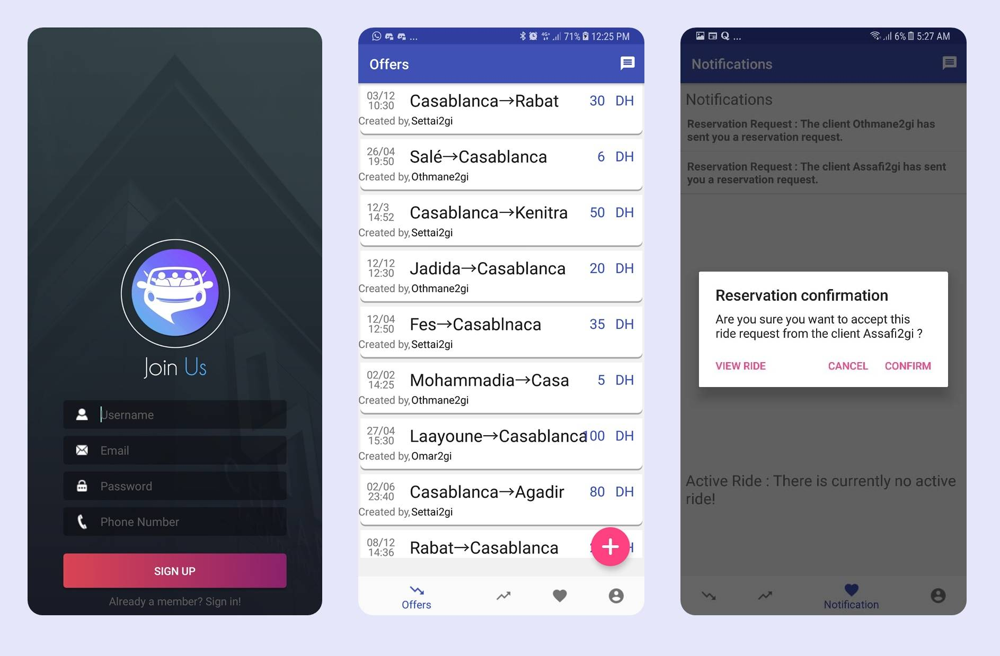
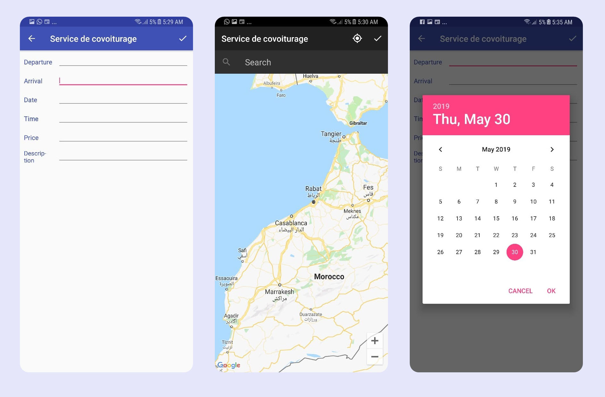

# Carpooling-App - Ride Sharing Mobile App

## Description

This is a carpooling mobile app, it allows its users to connect public transit riders to drivers headed in the same direction. passengers save time and enjoy a more comfortable ride, while drivers save some money by sharing the cost of the commute.

## Technologies

This is a fully native android app, based on the following technologies : 

- Firebase Realtime Database for storing data
- Native android (JAVA)
- Google Cloud Functions for sending notifications to users.
- Google Maps API

## Features

- GoogleMaps API integration for location services such as selecting arrival and destination point
- Both offers and requests can be posted by users.
- User Rating and Report System
- Invitation System
- Chat System
- Admin dashboard

## **Getting Started**

- Download the latest Android Studio.

[https://developer.android.com/studio/](https://developer.android.com/studio/)

- Connect an Android mobile phone to your system if you want to deploy the app on your device, otherwise use the emulator on Android Studio.

[https://developer.android.com/studio/run/emulator](https://developer.android.com/studio/run/emulator)

- Clone or download the project from this GitHub repository.
- Use Android Studio to open the project.

Navigate to the app folder in the root of the Carpool app project folder. Choose app folder to open project in Android Studio

## **Troubleshooting**

If the app does not run at first, run Gradle Sync.

Tools → Android → Sync Project with Gradle Files

If there is an issue with Gradle not being installed, see:

[https://gradle.org/install/](https://gradle.org/install/)

## Screenshots / Preview

